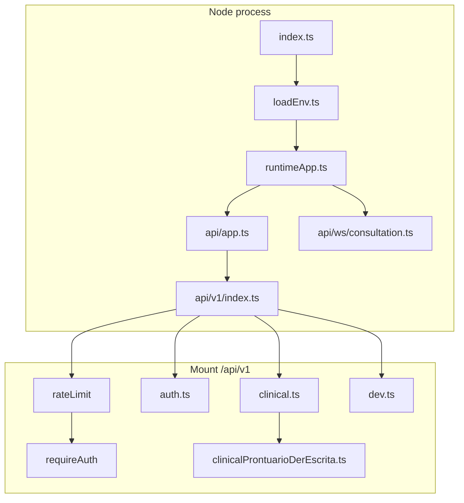

# Backend - API Pre-natal Digital (Hono + Prisma)

Servico HTTP (REST em `/api/v1`), `GET /health`, documentacao OpenAPI e WebSocket de consulta (`/ws/consultation/:id`). Autenticacao JWT para rotas clinicas; login publico.

**Ambiente Docker, Postgres, variaveis completas e fluxo com o frontend:** [../README.md](../README.md) (pasta `Codigo/`).

---

## Indice

1. [Stack e scripts](#stack-e-scripts)
2. [Inicio rapido](#inicio-rapido)
3. [Carregamento de variaveis de ambiente](#carregamento-de-variaveis-de-ambiente)
4. [Arranque e encerramento](#arranque-e-encerramento)
5. [Arquitetura HTTP](#arquitetura-http)
6. [Autenticacao e rate limit](#autenticacao-e-rate-limit)
7. [Rotas fora de `/api/v1`](#rotas-fora-de-apiv1)
8. [Rotas `/api/v1`](#rotas-apiv1)
9. [WebSocket da consulta](#websocket-da-consulta)
10. [Erros e codigos HTTP](#erros-e-codigos-http)
11. [Arvore `src/`](#arvore-src)
12. [Prisma](#prisma)
13. [Testes](#testes)
14. [Variaveis de ambiente (resumo)](#variaveis-de-ambiente-resumo)
15. [Integracao clinical-ai, MCP e Ollama](#integracao-clinical-ai-mcp-e-ollama)

---

## Stack e scripts

| Tecnologia | Uso |
|------------|-----|
| [Hono](https://hono.dev/) 4 | Framework HTTP |
| [@hono/node-server](https://github.com/honojs/node-server) | `serve()` Node |
| [@hono/node-ws](https://github.com/honojs/node-ws) | Upgrade WebSocket |
| [Prisma](https://www.prisma.io/) 7 + `@prisma/adapter-pg` | ORM + Postgres |
| [bcryptjs](https://github.com/dcodeIO/bcrypt.js) | Hash de senhas de profissionais |
| [dotenv](https://github.com/motdotla/dotenv) | Carga de `.env` |
| [Vitest](https://vitest.dev/) | Testes |

| Script | Descricao |
|--------|-----------|
| `npm run dev` | `tsx watch src/index.ts` |
| `npm run build` | `tsc` app + seed |
| `npm start` | `node dist/index.js` |
| `npm run prisma:generate` | `prisma generate` |
| `npm run prisma:migrate` | `prisma migrate dev` |
| `npm run prisma:deploy` | `prisma migrate deploy` |
| `npm run db:seed` | Compila seed e `prisma db seed` |
| `npm test` | `prisma generate` + `vitest run` |
| `npm run test:unit` | Subconjunto unitario |
| `npm run test:integration` | Integracao + WS |
| `npm run test:types` | `tsc` test project |

---

## Inicio rapido

```bash
cd Codigo/backend
npm install
# Garanta DATABASE_URL e JWT_SECRET em Codigo/.env (ver README do Codigo/)
npx prisma generate
npm run dev
```

Porta por omissao: `PORT` ou **3000**. O frontend em desenvolvimento deve apontar `VITE_API_BASE_URL` para esta origem; CORS usa `FRONTEND_ORIGIN`.

---

## Carregamento de variaveis de ambiente

[`src/loadEnv.ts`](src/loadEnv.ts):

1. Carrega `backend/.env` (se existir).
2. Carrega `Codigo/.env` com **override** (valores na raiz do compose prevalecem sobre um `.env` local so na pasta `backend`).
3. Chama `assertDatabaseUrlNotPlaceholder()` em [`src/lib/env/assertDatabaseUrl.ts`](src/lib/env/assertDatabaseUrl.ts) para evitar `DATABASE_URL` placeholder em arranque.

O ficheiro [`src/index.ts`](src/index.ts) importa primeiro `./loadEnv.js` para aplicar variaveis de ambiente antes do resto do modulo.

---

## Arranque e encerramento

[`src/index.ts`](src/index.ts):

- `createRuntimeApp()` em [`src/runtimeApp.ts`](src/runtimeApp.ts): `createApp()` + `createNodeWebSocket` + registo [`registerConsultationWebSocket`](src/api/ws/consultation.ts).
- `serve({ fetch: app.fetch, port }, callback)` e `injectWebSocket(server)`.
- `SIGINT` / `SIGTERM`: `disconnectPrisma()` e `process.exit(0)`.

---

## Arquitetura HTTP



[`src/api/app.ts`](src/api/app.ts):

- **CORS:** `FRONTEND_ORIGIN` - lista separada por virgulas; fallback `http://localhost:5173`.
- **`GET /openapi.json`:** documento gerado por [`src/api/openapi.ts`](src/api/openapi.ts).
- **`GET /swagger`:** UI Swagger (`@hono/swagger-ui`).
- **`GET /health`:** [`getHealthStatus`](src/services/healthService.ts) - JSON agregado (DB, MCP, gateway de privacidade, Ollama, clinical-ai); HTTP 200 ou 503 se a base falhar.
- **`app.route("/api/v1", v1)`** apos `registerApiV1Routes(app)`.
- **`app.onError`:** [`mapAppError`](src/core/errors.ts).

---

## Autenticacao e rate limit

### JWT

- [`src/middleware/requireAuth.ts`](src/middleware/requireAuth.ts): header `Authorization: Bearer <token>`; verificacao HS256 com [`getJwtSecret()`](src/config/envAuth.ts) (minimo 32 caracteres); `sub` = id do profissional; `email` no payload.
- [`src/services/authService.ts`](src/services/authService.ts): `POST /auth/login` valida credenciais com `ProfissionalRepository` + bcrypt; `sign({ sub, email, iat, exp })`; `expires_in` de [`getJwtExpiresSec()`](src/config/envAuth.ts) (env `JWT_EXPIRES_SEC` ou omissao 8 h).

### Excecao publica em `/api/v1`

[`src/api/v1/index.ts`](src/api/v1/index.ts): `POST` cujo path e `/auth/login` (ou termina em `/auth/login`) **nao** passa por `requireAuth`; todas as outras rotas do mount sim.

### Rate limit

[`src/middleware/rateLimit.ts`](src/middleware/rateLimit.ts): buckets em memoria por chave (`X-Forwarded-For` / `X-Real-IP` / `Authorization`). Dois perfis:

- **API geral:** `API_RATE_LIMIT_MAX` (default 120), `API_RATE_LIMIT_WINDOW_MS` (60_000).
- **Rotas AI-like** (limite mais baixo): `AI_RATE_LIMIT_MAX` (default 20), `AI_RATE_LIMIT_WINDOW_MS` - paths que contem ou terminam em `/clinical/livia/...`, `/dev/sanitize`, `/dev/ollama/`, `/dev/rag/`, `/dev/mcp/`.

---

## Rotas fora de `/api/v1`

| Metodo | Caminho | Auth | Descricao |
|--------|---------|------|-----------|
| GET | `/health` | Nao | Estado agregado do sistema. |
| GET | `/openapi.json` | Nao | Esquema OpenAPI. |
| GET | `/swagger` | Nao | UI Swagger. |
| GET | `/ws/consultation/:id` | Query `token` (JWT) | Upgrade WebSocket (ver secao dedicada). |

---

## Rotas `/api/v1`

Prefixo real: **`/api/v1`** + path abaixo. Salvo indicacao, todas exigem JWT (exceto login).

### Auth

| Metodo | Path | Descricao |
|--------|------|-----------|
| POST | `/auth/login` | Publico. Corpo JSON `{ email, password }` -> `access_token`, `profissional`, `expires_in`. |

### Pacientes, gestacoes, consultas, unidades, Livia

Implementacao principal: [`src/api/v1/clinical.ts`](src/api/v1/clinical.ts) (handlers longos com parsing de payload e validacao).

| Metodo | Path | Descricao resumida |
|--------|------|--------------------|
| GET | `/pacientes` | Lista assepsisada (mascarados + ultimos digitos). |
| POST | `/pacientes/verificar-identificadores` | Verificacao de duplicidade por hashes de CPF/cartao. |
| GET | `/pacientes/:id` | Detalhe assepsisado. |
| PATCH | `/pacientes/:id` | Atualizacao de perfil. |
| GET | `/pacientes/:id/full` | Carga completa para prontuario. |
| POST | `/pacientes` | Cadastro com hashes (`PACIENTE_IDS_PEPPER`). |
| GET | `/gestacoes` | Query `paciente_id`. |
| GET | `/gestacoes/:id` | Uma gestacao. |
| POST | `/gestacoes` | Nova gestacao. |
| PATCH | `/gestacoes/:id` | Atualizacao (datas, risco, campos clinicos). |
| PATCH | `/gestacoes/:id/antecedentes` | Antecedentes DER. |
| POST | `/clinical/livia/context` | Contexto textual para a Livia (proxy/servico). |
| POST | `/clinical/livia/suggestions` | Sugestoes de prompts. |
| GET | `/consultas` | Query `gestacao_id`. |
| GET | `/consultas/disponiveis-stream` | Stream de worklist (corpo em fluxo). |
| GET | `/consultas/calendario` | Intervalo de datas. |
| GET | `/consultas/:id` | Detalhe da consulta. |
| PATCH | `/consultas/:id` | Atualizacao (incl. conduta, validacao medica, etc.). |
| POST | `/consultas/:id/recriar-para-escriba` | Fluxo escriba. |
| DELETE | `/consultas/:id` | Remocao. |
| POST | `/consultas` | Criacao (gestacao + unidade + data). |
| GET | `/unidades` | Lista de unidades. |

Servicos tipicos: [`pacienteCadastroComIdsService`](src/services/pacienteCadastroComIdsService.ts), [`consultaPatchService`](src/services/consultaPatchService.ts), [`liviaContextService`](src/services/liviaContextService.ts), [`riscoEstratificacaoService`](src/services/riscoEstratificacaoService.ts), repositorios em `src/repository/`.

### Prontuario DER (escrita)

[`src/api/v1/clinicalProntuarioDerEscrita.ts`](src/api/v1/clinicalProntuarioDerEscrita.ts) - registado no fim de `registerClinicalV1Routes` via `registerProntuarioDerEscritaRoutes(secured)`.

| Metodo | Path |
|--------|------|
| PATCH | `/pacientes/:id/parceiro` |
| POST | `/pacientes/:id/vacinas` |
| PATCH | `/vacinas/:id` |
| DELETE | `/vacinas/:id` |
| POST | `/pacientes/:id/exames` |
| PATCH | `/exames/:id` |
| DELETE | `/exames/:id` |
| POST | `/gestacoes/:id/usgs` |
| PATCH | `/usgs/:id` |
| DELETE | `/usgs/:id` |
| PATCH | `/gestacoes/:id/avaliacao-odonto` |
| PATCH | `/gestacoes/:id/plano-parto` |
| PATCH | `/gestacoes/:id/desfecho` |
| POST | `/gestacoes/:id/consultas-pos-parto` |
| PATCH | `/consultas-pos-parto/:id` |
| DELETE | `/consultas-pos-parto/:id` |

---

### Dev / sandbox (admin e flags de servidor)

[`src/api/v1/dev.ts`](src/api/v1/dev.ts). Politica de admin: [`src/config/devAdmin.ts`](src/config/devAdmin.ts) - `DEV_ADMIN_EMAILS` (lista CSV) ou, se vazio, apenas `SEED_PROFISSIONAL_EMAIL`.

| Metodo | Path | Notas |
|--------|------|--------|
| GET | `/dev/profissionais/eligibility` | `createEnabled`, `callerIsAdmin`. |
| GET | `/dev/sandbox/db-delete-eligibility` | `deleteEnabled`, `callerIsAdmin`. |
| DELETE | `/dev/pacientes/:id` | Requer `DEV_ALLOW_SANDBOX_DB_DELETE=1` + admin. |
| DELETE | `/dev/gestacoes/:id` | Idem. |
| POST | `/dev/profissionais` | Requer `DEV_ALLOW_PROFISSIONAL_CREATE=1` + admin. |
| POST | `/dev/sanitize` | Gateway MCP / clinical-ai; limite AI rate. |
| POST | `/dev/ollama/insight` | Sanitize + stream agregado Ollama. |
| GET | `/dev/clinical-ai/health` | Proxy `GET {CLINICAL_AI_URL}/health`. |
| POST | `/dev/rag/test/query` | Proxy para clinical-ai. |
| POST | `/dev/rag/test/rebuild` | Query `?force=true` opcional. |
| POST | `/dev/mcp/test/direct-question` | Proxy JSON. |
| POST | `/dev/mcp/test/direct-question-stream` | Proxy NDJSON + `clinicalAiProxyConcurrencyLimiter`. |

Proxies usam `CLINICAL_AI_URL` normalizado ([`httpUrl.ts`](src/lib/httpUrl.ts)) e [`clinicalAiProxyConcurrencyLimiter`](src/lib/concurrencyLimiter.ts) (`CLINICAL_AI_PROXY_CONCURRENCY_LIMIT`, etc., no [`.env.example` do Codigo](../.env.example)).

---

## WebSocket da consulta

- **URL:** `GET /ws/consultation/:id?token=<JWT>`.
- **Registo:** [`src/api/ws/consultation.ts`](src/api/ws/consultation.ts).
- **Regras:** UUID valido; token HS256 valido; consulta existente; se `status === CONFIRMADA`, encerra com erro (consulta ja confirmada).
- **Estado:** passa consulta para `EM_ANDAMENTO`; envia `history` + `ready`.
- **Sessao:** [`ConsultationStreamService`](src/services/consultationStreamService.ts) / [`ConsultationStreamSession`](src/services/consultationStreamService.ts): audio binario -> STT ([`FasterWhisperClient`](src/lib/stt/fasterWhisperClient.ts)); debounce/VAD -> sanitize ([`mcpGateway`](src/lib/privacyMcpGateway.ts)) + LLM ([`OllamaStreamClient`](src/lib/llm/ollamaStreamClient.ts)); mensagens alinhadas ao frontend: `stt_partial`, `ia_token`, `ia_done`, `error`.
- **Cliente:** texto JSON `{"type":"vad_pause"}` para forcar flush; chunks binarios para audio.

---

## Erros e codigos HTTP

[`src/core/errors.ts`](src/core/errors.ts):

- **`AppError`:** resposta JSON `{ code, message }` com status explicito (400 validacao, 401 credenciais, 403 proibido, 404, 409, 502 bad gateway em rotas dev, etc.).
- **`HTTPException`:** Hono (ex.: 401 em `requireAuth`).
- **`ConcurrencyLimitExceededError`:** 429 + header `Retry-After: 1` (limites externos saturados).
- **Erros nao tratados:** 500 `internal_error`; em dev, `stack` no log servidor.

---

## Arvore `src/`

### Entrada e API

| Ficheiro | Funcao |
|----------|--------|
| [`index.ts`](src/index.ts) | `serve`, WebSocket inject, shutdown. |
| [`runtimeApp.ts`](src/runtimeApp.ts) | Compoe app HTTP + WS. |
| [`loadEnv.ts`](src/loadEnv.ts) | dotenv + validacao `DATABASE_URL`. |
| [`api/app.ts`](src/api/app.ts) | CORS, OpenAPI, Swagger, health, `registerApiV1Routes`, `onError`. |
| [`api/openapi.ts`](src/api/openapi.ts) | Documento OpenAPI servido em `/openapi.json`. |
| [`api/v1/index.ts`](src/api/v1/index.ts) | Mount `/api/v1`, rate limit, auth exceto login, registos auth/clinical/dev. |
| [`api/v1/auth.ts`](src/api/v1/auth.ts) | Login. |
| [`api/v1/clinical.ts`](src/api/v1/clinical.ts) | Rotas clinicas principais + chamada a DER. |
| [`api/v1/clinicalProntuarioDerEscrita.ts`](src/api/v1/clinicalProntuarioDerEscrita.ts) | Rotas DER escrita. |
| [`api/v1/dev.ts`](src/api/v1/dev.ts) | Sandbox e proxies. |
| [`api/ws/consultation.ts`](src/api/ws/consultation.ts) | Upgrade WS por consulta. |

### Middleware

| Ficheiro | Funcao |
|----------|--------|
| [`middleware/requireAuth.ts`](src/middleware/requireAuth.ts) | JWT Bearer -> `c.set("profissional", { id, email })`. |
| [`middleware/rateLimit.ts`](src/middleware/rateLimit.ts) | Rate limit por IP/auth e por grupo API/AI. |

### Core

| Ficheiro | Funcao |
|----------|--------|
| [`core/errors.ts`](src/core/errors.ts) | `AppError`, `mapAppError`. |

### Config

| Ficheiro | Funcao |
|----------|--------|
| [`config/envAuth.ts`](src/config/envAuth.ts) | `JWT_SECRET`, `JWT_EXPIRES_SEC`. |
| [`config/envPacienteIds.ts`](src/config/envPacienteIds.ts) | `PACIENTE_IDS_PEPPER` obrigatorio para hashes. |
| [`config/devAdmin.ts`](src/config/devAdmin.ts) | Flags dev + `isEmailDevAdmin`. |

### Repositorios

| Ficheiro | Funcao |
|----------|--------|
| [`repository/prisma.ts`](src/repository/prisma.ts) | Singleton `PrismaClient` + adapter pg; `disconnectPrisma`. |
| [`repository/pacienteRepository.ts`](src/repository/pacienteRepository.ts) | CRUD/listagens paciente assepsisado. |
| [`repository/gestacaoRepository.ts`](src/repository/gestacaoRepository.ts) | Gestacoes. |
| [`repository/consultaRepository.ts`](src/repository/consultaRepository.ts) | Consultas e eventos de stream. |
| [`repository/unidadeRepository.ts`](src/repository/unidadeRepository.ts) | Unidades. |
| [`repository/profissionalRepository.ts`](src/repository/profissionalRepository.ts) | Profissionais / auth. |
| [`repository/pacienteIdsRepository.ts`](src/repository/pacienteIdsRepository.ts) | Hashes de identificadores. |
| [`repository/healthRepository.ts`](src/repository/healthRepository.ts) | `pingDb` para healthcheck. |

### Servicos

| Ficheiro | Funcao |
|----------|--------|
| [`services/authService.ts`](src/services/authService.ts) | Login JWT, hash de senha. |
| [`services/healthService.ts`](src/services/healthService.ts) | Agregacao `/health`. |
| [`services/consultaPatchService.ts`](src/services/consultaPatchService.ts) | Regras de PATCH de consulta. |
| [`services/consultationStreamService.ts`](src/services/consultationStreamService.ts) | Sessao WS STT/RAG/LLM. |
| [`services/liviaContextService.ts`](src/services/liviaContextService.ts) | Contexto e sugestoes Livia. |
| [`services/pacienteCadastroComIdsService.ts`](src/services/pacienteCadastroComIdsService.ts) | Cadastro e verificacao de IDs. |
| [`services/riscoEstratificacaoService.ts`](src/services/riscoEstratificacaoService.ts) | Sincronizacao tipo de risco (MS 2024). |

### Domain

| Ficheiro | Funcao |
|----------|--------|
| [`domain/gestacaoPatchDateParse.ts`](src/domain/gestacaoPatchDateParse.ts) | Parsing seguro de datas em PATCH gestacao. |
| [`domain/riscoMs2024.ts`](src/domain/riscoMs2024.ts) | Regras de risco habitual/alto. |

### Lib

| Ficheiro | Funcao |
|----------|--------|
| [`lib/prismaBarrel.ts`](src/lib/prismaBarrel.ts) | Re-export do client/enums Prisma. |
| [`lib/httpUrl.ts`](src/lib/httpUrl.ts) | Normalizacao de bases HTTP. |
| [`lib/validation/uuid.ts`](src/lib/validation/uuid.ts) | Validacao UUID. |
| [`lib/identificadores/pacienteIdsHash.ts`](src/lib/identificadores/pacienteIdsHash.ts) | HMAC/pepper para CPF/cartao. |
| [`lib/identificadores/pacienteUltimosDigitos.ts`](src/lib/identificadores/pacienteUltimosDigitos.ts) | Exibicao mascarada. |
| [`lib/promptInjectionSanitize.ts`](src/lib/promptInjectionSanitize.ts) | Limpeza de texto nao confiavel (LLM). |
| [`lib/privacyMcpGateway.ts`](src/lib/privacyMcpGateway.ts) | Gateway noop vs HTTP (sanitize). |
| [`lib/concurrencyLimiter.ts`](src/lib/concurrencyLimiter.ts) | Limites de concorrencia (sanitize, LLM, STT, proxy clinical-ai). |
| [`lib/llm/ollamaStreamClient.ts`](src/lib/llm/ollamaStreamClient.ts) | Chamadas streaming ao Ollama. |
| [`lib/stt/fasterWhisperClient.ts`](src/lib/stt/fasterWhisperClient.ts) | STT (chunks parciais). |
| [`lib/env/assertDatabaseUrl.ts`](src/lib/env/assertDatabaseUrl.ts) | Validacao de `DATABASE_URL` no arranque (import em `loadEnv`). |

---

## Prisma

- **Esquema:** [`prisma/schema.prisma`](prisma/schema.prisma).
- **Seed:** [`prisma/seed.ts`](prisma/seed.ts) (unidade seed, profissional de teste, etc.).
- **Migracoes:** [`prisma/migrations/`](prisma/migrations/).
- **Notas de migracao:** [`prisma/FALHAS-MIGRACAO.md`](prisma/FALHAS-MIGRACAO.md) (troubleshooting).
- **Config Prisma 7:** [`prisma/prisma.config.ts`](prisma/prisma.config.ts), [`prisma.config.ts`](prisma.config.ts) na raiz do backend.

Fluxo completo de base de dados e Compose: [../README.md](../README.md).

---

## Testes

- **Config:** [`vitest.config.ts`](vitest.config.ts), [`tsconfig.test.json`](tsconfig.test.json).
- **Unitarios:** hashes, patch consulta, risco MS, datas gestacao (`test/*.test.ts` conforme `package.json`).
- **Integracao:** `backend.integration.test.ts`, `ws.integration.test.ts` (Postgres via Testcontainers quando aplicavel).

---

## Variaveis de ambiente (resumo)

Lista nao exaustiva; ver **[`../.env.example`](../.env.example)**.

| Variavel | Papel |
|----------|--------|
| `NODE_ENV` | `development` / producao (logs Prisma, detalhe de erros). |
| `PORT` | Porta HTTP do backend. |
| `DATABASE_URL` | Postgres para Prisma. |
| `JWT_SECRET` | HS256 (min. 32 caracteres). |
| `JWT_EXPIRES_SEC` | Validade do access token (opcional). |
| `FRONTEND_ORIGIN` | CORS (CSV). |
| `PACIENTE_IDS_PEPPER` | Segredo para hashes de CPF/cartao. |
| `API_RATE_LIMIT_*` / `AI_RATE_LIMIT_*` | Rate limit. |
| `SANITIZE_CONCURRENCY_LIMIT`, `LLM_CONCURRENCY_LIMIT`, `STT_CONCURRENCY_LIMIT`, `CLINICAL_AI_PROXY_CONCURRENCY_LIMIT` | Concorrencia interna. |
| `CLINICAL_AI_URL` | Base do servico FastAPI (RAG/MCP/stream). |
| `MCP_SERVER_URL` | Sidecar sanitize (alternativa/complemento ao clinical-ai). |
| `OLLAMA_HTTP_URL` | Sondagem e chamadas Ollama. |
| `STREAM_RAG_DEBOUNCE_MS`, `STREAM_RAG_MIN_CHARS` | Debounce da pipeline WS. |
| `DEV_ADMIN_EMAILS` | Admins CSV para rotas `/dev/*` sensiveis. |
| `DEV_ALLOW_PROFISSIONAL_CREATE` | `1` para permitir `POST /dev/profissionais`. |
| `DEV_ALLOW_SANDBOX_DB_DELETE` | `1` para permitir deletes sandbox. |
| `SEED_PROFISSIONAL_EMAIL` | Fallback de admin se `DEV_ADMIN_EMAILS` vazio. |

---

## Integracao clinical-ai, MCP e Ollama

- **`/health`:** sonda Postgres, flags `MCP_SERVER_URL` / `CLINICAL_AI_URL`, gateway ([`getPrivacyGateway`](src/lib/privacyMcpGateway.ts)), reachability Ollama (`OLLAMA_HTTP_URL` + `/api/tags`) e clinical-ai (`/health` + `gemini_configured`).
- **Rotas `/dev/...`:** em geral encaminham para `CLINICAL_AI_URL` com o mesmo path relativo (`/rag/...`, `/mcp/...`) ou usam [`mcpGateway().sanitizeForModel`](src/lib/privacyMcpGateway.ts) + Ollama local em `/dev/ollama/insight`.
- **Conteudo clinico em `clinical.ts`:** Livia e strips LLM podem usar [`stripUntrustedLlmText`](src/lib/promptInjectionSanitize.ts) onde aplicavel.

Para alterar contratos HTTP em profundidade, atualize o backend e o documento OpenAPI; mantenha o [README do frontend](../frontend/README.md) alinhado aos paths consumidos pela SPA.
