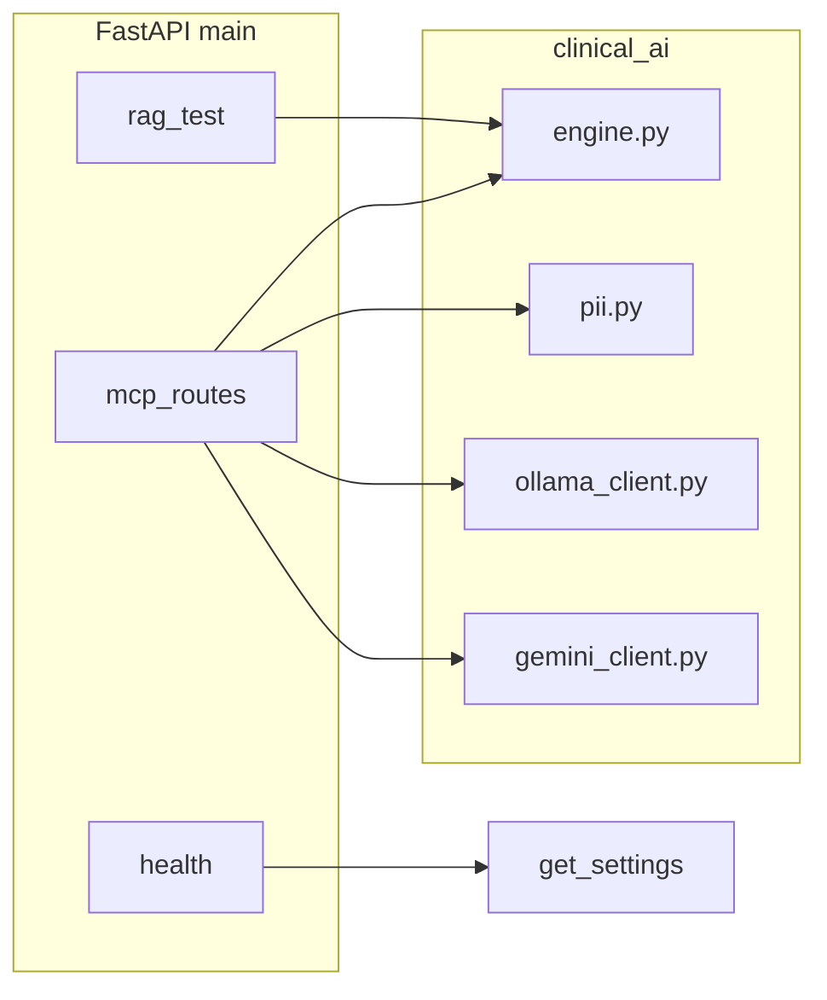

# Clinical AI (RAG + contexto clínico)

Serviço **FastAPI** usado pelo backend Node ([`CLINICAL_AI_URL`](../README.md)): indexação de cartilhas (RAG), sanitização de PII, recuperação de trechos, respostas via **Ollama** (local) ou **Gemini** (opcional), incluindo fluxo **NDJSON** consumido pela Lívia no frontend.

**Docker, portas, variáveis no Compose e ligação ao backend:** [../README.md](../README.md) (pasta `Codigo/`). Modelo de env: [../.env.example](../.env.example).

---

## Índice

1. [Stack e arranque](#stack-e-arranque)
2. [Arquitetura](#arquitetura)
3. [Rotas HTTP](#rotas-http)
4. [Fluxo NDJSON (`/mcp/test/direct-question-stream`)](#fluxo-ndjson-mcptestdirect-question-stream)
5. [Pacote `clinical_ai/`](#pacote-clinical_ai)
6. [Corpus e armazenamento vetorial](#corpus-e-armazenamento-vetorial)
7. [Variáveis de ambiente](#variáveis-de-ambiente)
8. [Testes](#testes)
9. [Integração com o backend](#integração-com-o-backend)

---

## Stack e arranque

| Componente | Uso |
|------------|-----|
| Python | `>= 3.11` ([`pyproject.toml`](pyproject.toml)); imagem Docker `3.12-slim` ([`Dockerfile`](Dockerfile)) |
| [FastAPI](https://fastapi.tiangolo.com/) | API HTTP |
| [Uvicorn](https://www.uvicorn.org/) | ASGI (`clinical_ai.main:app`, porta **4010** no Compose) |
| [Pydantic Settings](https://docs.pydantic.dev/latest/concepts/pydantic_settings/) | [`config.py`](clinical_ai/config.py) — env com prefixos implícitos (aliases em maiúsculas) |
| [httpx](https://www.python-httpx.org/) | Cliente HTTP assíncrono (Ollama / Gemini) |
| `pypdf`, `python-docx` | Ingestão de PDF/DOCX no corpus ([`requirements.txt`](requirements.txt)) |

### Desenvolvimento local

```bash
cd Codigo/clinical-ai
python3 -m venv .venv
source .venv/bin/activate   # Windows: .venv\Scripts\activate
pip install -r requirements.txt
# Opcional: copie variáveis de Codigo/.env ou crie clinical-ai/.env (ver pydantic env_file em Settings)
uvicorn clinical_ai.main:app --reload --host 0.0.0.0 --port 4010
```

O backend em desenvolvimento deve ter `CLINICAL_AI_URL=http://127.0.0.1:4010` (ou equivalente) no `Codigo/.env`.

### Docker

Ver serviço `clinical_ai` em [`../docker-compose.yml`](../docker-compose.yml): build a partir desta pasta, volume `clinical_rag_data` em `/app/data`, Ollama no host via `host.docker.internal:11434` por omissão.

---

## Arquitetura



- **`lifespan`** ([`main.py`](clinical_ai/main.py)): ao subir, tenta `engine.build_index()`; se falhar, o serviço continua no ar e o erro fica no log (útil sem corpus/Ollama ainda).
- **RAG:** `engine` carrega documentos de [`corpus.py`](clinical_ai/corpus.py), faz chunking ([`chunking.py`](clinical_ai/chunking.py)), embeddings via Ollama, persistência opcional em SQLite ([`vector_store.py`](clinical_ai/vector_store.py)), retrieve + rerank ([`rerank.py`](clinical_ai/rerank.py)).
- **PII:** [`pii.py`](clinical_ai/pii.py) combina [`prompt_sanitize.py`](clinical_ai/prompt_sanitize.py) com máscaras (CPF, CNS, email, telefone, sequências longas de dígitos).
- **Resposta visível:** [`reply_sanitize.py`](clinical_ai/reply_sanitize.py) no stream Ollama.

---

## Rotas HTTP

Todas as rotas abaixo são **internas** (rede Docker ou localhost); o backend expõe proxies autenticados sob `/api/v1/dev/...` quando `CLINICAL_AI_URL` está definido.

| Método | Caminho | Descrição |
|--------|---------|-----------|
| GET | `/health` | `status`, `ollama`, `index`, modelos RAG/LLM, `gemini_configured`, etc. |
| POST | `/rag/test/query` | Corpo [`RagQueryBody`](clinical_ai/main.py): `query`, `top_k`, `expand_query` — devolve trechos RAG + tempos. |
| POST | `/rag/test/rebuild` | Query `force` — reconstrói índice (`engine.build_index`). |
| POST | `/mcp/sanitize` | JSON `{ "input": "..." }` — mesmo contrato esperado pelo `privacyMcpGateway` no backend. |
| POST | `/sanitize` | Alias de `/mcp/sanitize` para bases URL sem path `/mcp/...`. |
| POST | `/mcp/test/direct-question` | Uma resposta JSON agregada (Ollama; não usa Gemini neste handler). |
| POST | `/mcp/test/direct-question-stream` | **`application/x-ndjson`**: ver secção seguinte. |

---

## Fluxo NDJSON (`/mcp/test/direct-question-stream`)

Corpo JSON [`DirectQuestionBody`](clinical_ai/main.py): `question`, opcionalmente `gestacao_context`, `consulta_escriba_context`, `top_k`, `rag_expand_query`, `think`, `llm_provider` (`ollama` \| `gemini` \| `auto`).

1. **Primeira linha:** `{"type":"pipeline", ...}` — metadados (sanitização, chunks RAG, `num_predict`, `think_enabled`, `llm_provider_requested`, etc.).
2. **Seguintes:** objetos `{"type":"ollama", ...}` com `thinking`, `content` (delta ou substituição com `content_replace`), `metrics`, `done` por chunk; no modo Gemini o mesmo formato é reutilizado onde aplicável.
3. **Fim:** linha `{"type":"done"}`.
4. **Erro:** `{"type":"error", "detail":"..."}`.

O frontend lê o stream com leitor NDJSON ([`readNdjsonStream`](../frontend/src/lib/readNdjsonStream.ts)); o backend reencaminha o corpo em [`dev.ts`](../backend/src/api/v1/dev.ts).

---

## Pacote `clinical_ai/`

| Módulo | Função |
|--------|--------|
| [`main.py`](clinical_ai/main.py) | App FastAPI, modelos Pydantic, rotas, composição de mensagens para o LLM. |
| [`config.py`](clinical_ai/config.py) | `Settings` + `get_settings()` (cache LRU). |
| [`engine.py`](clinical_ai/engine.py) | Build do índice, `retrieve`, formatação do bloco de contexto RAG, estatísticas. |
| [`corpus.py`](clinical_ai/corpus.py) | Descoberta e leitura de ficheiros do corpus (md, txt, pdf, docx, jsonl). |
| [`chunking.py`](clinical_ai/chunking.py) | Divisão de texto em chunks com sobreposição. |
| [`vector_store.py`](clinical_ai/vector_store.py) | SQLite + vetores (cache de embeddings). |
| [`rerank.py`](clinical_ai/rerank.py) | Reranking MMR / recência. |
| [`boilerplate.py`](clinical_ai/boilerplate.py) | Filtros de chunks genéricos. |
| [`ollama_client.py`](clinical_ai/ollama_client.py) | Health, embeddings, chat completion e stream. |
| [`gemini_client.py`](clinical_ai/gemini_client.py) | Stream Gemini quando configurado. |
| [`pii.py`](clinical_ai/pii.py) | Sanitização para modelo e blocos opcionais. |
| [`prompt_sanitize.py`](clinical_ai/prompt_sanitize.py) | Remoção de texto não confiável antes das máscaras PII. |
| [`reply_sanitize.py`](clinical_ai/reply_sanitize.py) | Sanitização incremental da resposta assistente. |
| [`prompts.py`](clinical_ai/prompts.py) | System prompts (ex. `SYSTEM_DIRECT_QUESTION`). |
| [`safe_errors.py`](clinical_ai/safe_errors.py) | Mensagens públicas a partir de exceções. |

---

## Corpus e armazenamento vetorial

- **Diretório por omissão:** `corpus/CartilhasSUS` (relativo à raiz do pacote / `/app/corpus` no Docker). Sobrescrever com `RAG_CORPUS_DIR`.
- **SQLite por omissão:** `data/rag_store.sqlite` na raiz do projeto `clinical-ai` (ou `RAG_VECTOR_STORE_PATH`). `RAG_DISABLE_VECTOR_STORE` força re-embeddings.
- **Exportação opcional:** `RAG_EXPORT_CHUNKS_JSONL` — JSONL de chunks após `build_index` (auditoria).

Documentação local do corpus de exemplo: [`corpus/CartilhasSUS/README.md`](corpus/CartilhasSUS/README.md).

---

## Variáveis de ambiente

Definidas em [`clinical_ai/config.py`](clinical_ai/config.py) (alias = nome da variável de ambiente). Lista resumida; valores e defaults completos no [`.env.example` do Codigo](../.env.example).

| Variável | Papel |
|----------|--------|
| `OLLAMA_BASE_URL` | API Ollama (embeddings + chat). |
| `OLLAMA_MODEL` | Modelo de geração. |
| `RAG_EMBEDDING_MODEL` | Modelo de embeddings no Ollama. |
| `OLLAMA_TIMEOUT_S` | Timeout HTTP. |
| `OLLAMA_THINK` | Think por omissão quando o pedido não envia `think`. |
| `RAG_CORPUS_DIR` | Pasta do corpus. |
| `RAG_VECTOR_STORE_PATH` | Caminho SQLite. |
| `RAG_DISABLE_VECTOR_STORE` | Ignorar cache de vetores. |
| `RAG_CHUNK_MAX_CHARS`, `RAG_CHUNK_OVERLAP`, `RAG_EMBED_MAX_CHARS`, … | Chunking e limites de retrieve. |
| `RAG_MAX_CHUNKS`, `RAG_MAX_CHARS_PER_CHUNK`, `RAG_RERANK_*`, `RAG_MMR_LAMBDA`, `RAG_RECENCY_WEIGHT` | Retrieve e rerank. |
| `RAG_QUERY_EXPAND_ENABLED`, `RAG_QUERY_EXPAND_MAX_*` | Expansão de query via LLM antes do retrieve. |
| `MCP_CHAT_MAX_TOKENS`, `MCP_CHAT_THINK_*` | Orçamento `num_predict` Ollama (modo think). |
| `GEMINI_API_KEY`, `GEMINI_MODEL`, `GEMINI_TIMEOUT_S` | Fallback / modo `gemini` / `auto`. |

---

## Testes

```bash
cd Codigo/clinical-ai
pip install -r requirements.txt
pytest tests/ -q
```

Ficheiros em [`tests/`](tests/) (ex.: `test_prompt_sanitize.py`, `test_safe_errors.py`).

**Lint (opcional):** `pip install ".[dev]"` e `ruff check clinical_ai` conforme [`pyproject.toml`](pyproject.toml).

---

## Integração com o backend

- O backend define `CLINICAL_AI_URL` e chama caminhos espelhados (`/health`, `/rag/test/query`, `/mcp/test/direct-question-stream`, …) com [`proxyClinicalAi`](../backend/src/api/v1/dev.ts) e limitador de concorrência.
- O painel **Health** agregado do backend consulta `GET {CLINICAL_AI_URL}/health` e expõe `clinicalAiReachable` e `clinicalAiGeminiConfigured`.
- Sanitização MCP a partir do backend pode usar `MCP_SERVER_URL` a apontar para este serviço (`POST /mcp/sanitize` ou `POST /sanitize`) — ver [`privacyMcpGateway.ts`](../backend/src/lib/privacyMcpGateway.ts).

Para alterar o contrato dos corpos JSON, atualize os modelos Pydantic em [`main.py`](clinical_ai/main.py), o proxy no backend e a documentação no [README do frontend](../frontend/README.md) / [README do backend](../backend/README.md).
