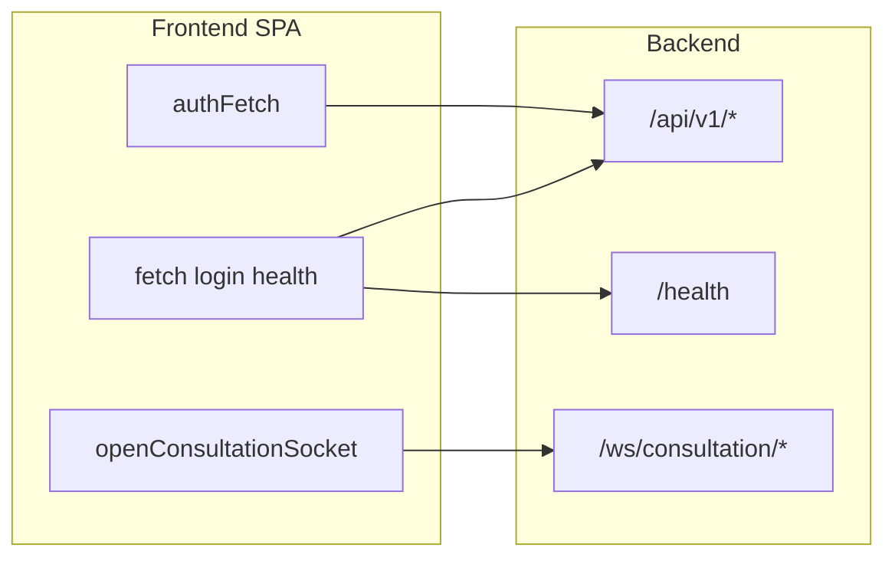

# Frontend — Pré-natal Digital (Vite + React)

SPA usada pelos profissionais de saúde: landing com login, agenda, lista de gestantes, prontuário eletrónico, modo Escriba (transcrição + IA) e área de desenvolvimento (admin).

**Guia de ambiente, Docker, Postgres/Prisma, backend e clinical-ai:** [../README.md](../README.md) (pasta `Codigo/`).

---

## Índice

1. [Stack e ferramentas](#stack-e-ferramentas)
2. [Início rápido](#início-rápido)
3. [Variáveis de ambiente (Vite)](#variáveis-de-ambiente-vite)
4. [Base HTTP e WebSocket](#base-http-e-websocket)
5. [Arranque da aplicação](#arranque-da-aplicação)
6. [Autenticação](#autenticação)
7. [Rotas (URL → componente)](#rotas-url--componente)
8. [Layout e navegação](#layout-e-navegação)
9. [Árvore `src/` (ficheiros)](#árvore-src-ficheiros)
10. [Páginas (resumo funcional)](#páginas-resumo-funcional)
11. [Componentes partilhados](#componentes-partilhados)
12. [Bibliotecas (`src/lib/`)](#bibliotecas-srclib)
13. [Catálogo de endpoints HTTP](#catálogo-de-endpoints-http)
14. [WebSocket da consulta](#websocket-da-consulta)
15. [Estilos (Tailwind)](#estilos-tailwind)
16. [Build, lint e deploy](#build-lint-e-deploy)

---

## Stack e ferramentas

| Tecnologia | Uso |
|------------|-----|
| [React](https://react.dev/) 19 | UI |
| [Vite](https://vite.dev/) 8 | Dev server e build |
| [TypeScript](https://www.typescriptlang.org/) ~6 | Tipagem |
| [Tailwind CSS](https://tailwindcss.com/) 4 + `@tailwindcss/vite` | Estilos (`src/index.css`) |
| [react-router-dom](https://reactrouter.com/) 7 | Rotas |
| [react-markdown](https://github.com/remarkjs/react-markdown) + [remark-gfm](https://github.com/remarkjs/remark-gfm) | Markdown (Lívia, sandbox) |

Scripts em `package.json`: `npm run dev`, `build`, `preview`, `lint`.

---

## Início rápido

```bash
cd Codigo/frontend
cp .env.example .env
# Edite .env: defina VITE_API_BASE_URL (ex.: http://127.0.0.1:3000 com o backend local)
npm install
npm run dev
```

Para aceder a partir de outro dispositivo na mesma rede: `npm run dev -- --host` e use no `.env` o IP do PC em `VITE_API_BASE_URL`.

---

## Variáveis de ambiente (Vite)

Todas expostas ao cliente têm prefixo `VITE_`. Modelo: [`.env.example`](.env.example).

| Variável | Obrigatória | Descrição |
|----------|-------------|-----------|
| `VITE_API_BASE_URL` | Recomendada | URL base do backend (HTTP). Em Docker com proxy na mesma origem pode ser `/` ou vazio — ver secção seguinte. |
| `VITE_LANDING_DEMO_VIDEO_URL` | Não | URL de embed (ex. iframe) na landing; vazio = placeholder. |
| `VITE_LANDING_SAMPLE_CARTILHA_PDF_URL` | Não | PDF da cartilha no viewer; omissão usa `/assets/docs/CadernetaGestante/CartilhaDaGestante.pdf` no build. |
| `VITE_LANDING_FEEDBACK_FORM_URL` | Não | Link “Responder ao formulário” (ex. Google Forms). |

---

## Base HTTP e WebSocket

Implementação: [`src/lib/apiBase.ts`](src/lib/apiBase.ts).

- **`getApiBaseUrl()`** lê `VITE_API_BASE_URL`. Se estiver indefinido, assume `http://localhost:3000`. Se for `""` ou `"/"`, devolve base vazia: pedidos `fetch` usam **mesma origem** do browser (adequado quando o nginx faz proxy de `/api`, `/ws`, `/health`, etc.).
- **`getWsBaseUrl()`** deriva o WebSocket: `http` → `ws`, `https` → `wss`. Com base vazia, usa `window.location` (host atual).

O login usa sempre `getApiBaseUrl()` + caminho absoluto (`/api/v1/auth/login`), coerente com o resto da app.

---

## Arranque da aplicação

1. [`index.html`](index.html) — `lang="pt-BR"`, `root`, entrada `main.tsx`.
2. [`src/main.tsx`](src/main.tsx) — `StrictMode` → `BrowserRouter` → `AuthProvider` → `App`.
3. [`src/App.tsx`](src/App.tsx) — definição de `<Routes>` (ver tabela abaixo).

---

## Autenticação

- **Contexto:** [`src/context/AuthContext.tsx`](src/context/AuthContext.tsx).
- **Login:** `POST {apiBase}/api/v1/auth/login` com JSON `{ email, password }`; guarda JWT e opcionalmente perfil do profissional.
- **Armazenamento:** [`src/lib/authSession.ts`](src/lib/authSession.ts) — `sessionStorage`: chave do token `prenatal_jwt` (`AUTH_TOKEN_STORAGE_KEY`), perfil `prenatal_profissional` (`AUTH_PROFISSIONAL_STORAGE_KEY`). `decodeJwtPayloadUnsafe` decodifica payload JWT **sem validar assinatura** (apenas para exibir e-mail de fallback).
- **`authFetch(path, init?)`:** prefixa `getApiBaseUrl()` + `path`, envia `Authorization: Bearer <token>`, `Accept: application/json`, e `Content-Type: application/json` quando o corpo é string. Em **401** (exceto no próprio login), abre fluxo de **reautenticação**; se o utilizador cancelar ou falhar, faz `logout`.
- **UI de re-login:** [`src/components/ReauthModal.tsx`](src/components/ReauthModal.tsx).

---

## Rotas (URL → componente)

Definidas em [`src/App.tsx`](src/App.tsx).

| Caminho | Autenticação | Componente | Notas |
|---------|--------------|------------|--------|
| `/` | Não (landing) | `LandingPage` | Login na própria página; com token redireciona para `state.from` ou `/dashboard`. |
| `/login` | — | Redireciona para `/` | Compatibilidade; `RequireAuth` manda não autenticados para `/login`, que volta à landing. |
| `/dashboard` | Sim + `MainLayout` | `DashboardPage` | Agenda do dia, worklist em stream, calendário semanal. |
| `/pacientes` | Sim + `MainLayout` | `PacientesPage` | Lista, filtros, cadastro gestante + gestação. |
| `/pacientes/:id` | Sim + `MainLayout` | `PacienteDetailPage` | Prontuário completo (ficheiro grande; ver secção dedicada). |
| `/consultas/:consultaId/escriba` | Sim + `MainLayout` | `EscribaPage` | Transcrição/IA + edição de campos da consulta + Lívia. |
| `/dev/sandbox` | Sim + `MainLayout` | `DevSandboxPage` | Só útil para admins; entrada no menu condicionada (ver `MainLayout`). |
| `*` | — | Redireciona para `/` | |

---

## Layout e navegação

[`src/layout/MainLayout.tsx`](src/layout/MainLayout.tsx):

- Cabeçalho fixo com marca “Pré-natal Digital”, pesquisa (mock), dados do profissional e botão **Sair**.
- **Sidebar** desktop (`lg`) e **drawer** em ecrãs menores; largura lógica exposta em CSS como `--app-nav-sidebar-width` (`0px` quando recolhido, `16rem` quando visível).
- Links principais: **Agenda do Dia** (`/dashboard`), **Gestantes** (`/pacientes`).
- **Dev Sandbox:** após `GET /api/v1/dev/profissionais/eligibility`, o menu mostra o link só se `callerIsAdmin === true` (alinhado à política do backend, ex. `DEV_ADMIN_EMAILS` / seed).

---

## Árvore `src/` (ficheiros)

| Ficheiro | Função |
|----------|--------|
| `main.tsx` | Montagem React + router + `AuthProvider`. |
| `App.tsx` | Rotas da aplicação. |
| `index.css` | Import Tailwind, `@theme` (cores marca), variáveis `--app-nav-sidebar-width`, `--livia-aside-width`. |
| `vite-env.d.ts` | Tipos `ImportMeta.env` do Vite. |
| **context/** | |
| `AuthContext.tsx` | Sessão, login, logout, `authFetch`, reauth. |
| **routes/** | |
| `RequireAuth.tsx` | Protege rotas aninhadas; sem token → `/login`. |
| **layout/** | |
| `MainLayout.tsx` | Shell autenticado (header, nav, `Outlet`). |
| **pages/** | |
| `LandingPage.tsx` | Marketing, login, documentos oficiais, carrossel de interfaces. |
| `DashboardPage.tsx` | Worklist stream, calendário, CRUD consultas. |
| `PacientesPage.tsx` | Lista gestantes, cadastro, verificação de identificadores. |
| `PacienteDetailPage.tsx` | Prontuário: paciente, gestação(ões), consultas, DER, antecedentes, módulos extra. |
| `EscribaPage.tsx` | Consulta em modo escriba + painéis Lívia e stream. |
| `DevSandboxPage.tsx` | Health, testes de API, MCP, RAG, Ollama, fluxo NDJSON Lívia, gestão dev de dados. |
| **pages/paciente-detail/** | |
| `DerModulosProntuario.tsx` | UI e persistência DER: odontologia, plano de parto, desfecho. |
| `derPersist.ts` | Funções de persistência: parceiro, vacinas, exames, USGs, consultas pós-parto. |
| `derEnums.ts` | Constantes `VACINA_TIPOS` / `EXAME_TIPOS` (strings alinhadas ao Prisma/API). |
| `useProntuarioDrafts.ts` | Hook: snapshots ao entrar em modo edição e abrir secções de detalhe. |
| **components/** | |
| `LiviaAssistantPanel.tsx` | Chat Lívia: sugestões, contexto clínico, stream NDJSON, estado em `sessionStorage`. |
| `ConsultaStreamPanel.tsx` | Stream de consultas disponíveis + wizard criação paciente/gestação/consulta + WS. |
| `AssistantMarkdown.tsx` | Renderização markdown (GFM) para respostas da assistente. |
| `ReauthModal.tsx` | Modal de credenciais quando `authFetch` recebe 401. |
| `BoolTriState.tsx` | Controlo tri-estado booleano (UI DER). |
| **components/landing/** | |
| `LandingCarousel.tsx` | Carrossel de imagens/captions na landing. |
| **data/** | |
| `landingOfficialDocuments.ts` | Metadados de documentos/links oficiais na landing. |
| **hooks/** | |
| `useLiviaDesktopAsideOpen.ts` | Estado do painel Lívia no desktop + `--livia-aside-width` + `sessionStorage`. |
| **lib/** | |
| `apiBase.ts` | `getApiBaseUrl`, `getWsBaseUrl`. |
| `authSession.ts` | Chaves storage, perfil, decode JWT payload. |
| `gestacaoDpp.ts` | Datas só calendário, DPP (Naegele 280 dias), DPP-eco, formatação pt-BR sem bug de fuso. |
| `uuid.ts` | `isUuid` para validar IDs nas rotas. |
| `readNdjsonStream.ts` | Leitor incremental de corpo `application/x-ndjson`. |
| `consultationSocket.ts` | `openConsultationSocket`, parsing de mensagens do WS da consulta. |

---

## Páginas (resumo funcional)

### LandingPage

- Login integrado (`useAuth().login`); redireciona se já existir token (`useEffect` com `from` em `location.state`).
- Slides de interface: constante `INTERFACE_SLIDES_META` + [`LandingCarousel`](src/components/landing/LandingCarousel.tsx).
- Documentos MS: [`landingOfficialDocuments.ts`](src/data/landingOfficialDocuments.ts); PDF da cartilha via env ou default em `public/`.
- Links externos (stack, MS publicações, etc.).

### DashboardPage

- Carrega worklist com `GET /api/v1/consultas/disponiveis-stream` (stream no corpo da resposta; consumo incremental no cliente).
- Calendário: `GET /api/v1/consultas/calendario` com query de intervalo de datas.
- Modais: unidades (`GET /api/v1/unidades`), pacientes (`GET /api/v1/pacientes`), criação/atualização/remoção de consultas (`POST`/`PATCH`/`DELETE` em `/api/v1/consultas`).
- Helpers locais para semana (início segunda), chaves de dia, `datetime-local`, formatação pt-BR.

### PacientesPage

- Lista: `GET /api/v1/pacientes`; filtro texto + risco (HABITUAL / ALTO / todos).
- Cadastro assistido: `POST /api/v1/pacientes/verificar-identificadores` → `POST /api/v1/pacientes` → `POST /api/v1/gestacoes`.
- Cálculo de DPP/IG na UI com [`gestacaoDpp.ts`](src/lib/gestacaoDpp.ts).

### PacienteDetailPage (visão macro)

Ficheiro volumoso; a lógica concentra-se em:

- **Carga inicial:** `GET /api/v1/pacientes/:id/full` (paciente, gestações, relações usadas no prontuário).
- **Auxiliares:** `GET /api/v1/unidades`; consultas por gestação `GET /api/v1/consultas?gestacao_id=…`.
- **Consultas:** criar `POST /api/v1/consultas`, apagar `DELETE /api/v1/consultas/:id`, atualizar dados da consulta via `PATCH` onde aplicável no mesmo ficheiro.
- **Gestação:** criar `POST /api/v1/gestacoes`, atualizar `PATCH /api/v1/gestacoes/:id`, antecedentes `PATCH …/antecedentes`.
- **Paciente:** atualizar perfil `PATCH /api/v1/pacientes/:id`.
- **DER no JSX:** comentários indicam blocos (mapeamento DER perfil + módulos, campos extra paciente, sífilis/suplementação, antecedentes, referências RAG).
- **Submódulos:** [`DerModulosProntuario.tsx`](src/pages/paciente-detail/DerModulosProntuario.tsx) (PATCH em `avaliacao-odonto`, `plano-parto`, `desfecho`); [`derPersist.ts`](src/pages/paciente-detail/derPersist.ts) para parceiro, vacinas, exames, USGs, pós-parto; [`useProntuarioDrafts.ts`](src/pages/paciente-detail/useProntuarioDrafts.ts) para hidratar rascunhos ao editar.

### EscribaPage

- Valida `consultaId` com `isUuid`.
- Carrega detalhe: `GET /api/v1/consultas/:id`; grava campos: `PATCH` no mesmo recurso; fluxo “recriar para escriba”: `POST …/recriar-para-escriba`.
- Abas transcrição / prontuário; espelha texto STT/IA vindos de [`ConsultaStreamPanel`](src/components/ConsultaStreamPanel.tsx).
- Painel Lívia: [`LiviaAssistantPanel`](src/components/LiviaAssistantPanel.tsx) + [`useLiviaDesktopAsideOpen`](src/hooks/useLiviaDesktopAsideOpen.ts).

### DevSandboxPage

- **Health:** `fetch(\`${getApiBaseUrl()}/health\`)` **sem** JWT (endpoint público de agregação do backend).
- **Gating:** `Navigate` para `/dashboard` se não admin; usa `GET /api/v1/dev/profissionais/eligibility` e `GET …/dev/sandbox/db-delete-eligibility`.
- **Login manual** no próprio ecrã (credenciais de teste) para inspecionar APIs sem sair da SPA.
- **Blocos de teste:** sanitize (`POST /api/v1/dev/sanitize`), Ollama insight (`POST …/dev/ollama/insight`), RAG query/rebuild, stream NDJSON igual Lívia (`POST …/dev/mcp/test/direct-question-stream` com opcional `POST …/clinical/livia/context` antes), listagens e deletes dev em pacientes/gestações, criação de profissional dev, botões de smoke para `pacientes` e `consultas/disponiveis-stream`.
- Consumo NDJSON: [`readNdjsonStream`](src/lib/readNdjsonStream.ts).

---

## Componentes partilhados

| Componente | Descrição |
|------------|-----------|
| `AssistantMarkdown` | Markdown seguro para mensagens da assistente (GFM). |
| `BoolTriState` | Checkbox tri-estado para campos DER. |
| `ConsultaStreamPanel` | Assina stream de consultas disponíveis; permite criar paciente/gestação/consulta em fluxo guiado; abre WebSocket de consulta quando aplicável. |
| `LiviaAssistantPanel` | Chat: chips de sugestões (`POST …/livia/suggestions`), envio com opcional contexto (`POST …/livia/context`), resposta em stream (`POST …/dev/mcp/test/direct-question-stream`); escolha de provider LLM (Ollama/Gemini/auto); histórico em `sessionStorage` por bucket de e-mail. |
| `ReauthModal` | Formulário de re-login quando a sessão expira durante `authFetch`. |

---

## Bibliotecas (`src/lib/`)

- **`apiBase` / `authSession` / `uuid`:** já descritos.
- **`gestacaoDpp`:** parsing de datas `DATE` da API ao meio-dia local (evita deslocamento de dia por UTC); Naegele +280 dias; DPP primário (eco vs DUM); IG textual.
- **`readNdjsonStream`:** lê `ReadableStream` linha a linha NDJSON.
- **`consultationSocket`:** ver secção WebSocket.

---

## Catálogo de endpoints HTTP

Lista dos caminhos **referenciados no código** do frontend (métodos implícitos pelo uso; o contrato exacto de corpo/resposta pertence ao backend).

**Autenticação**

- `POST /api/v1/auth/login`

**Pacientes**

- `GET /api/v1/pacientes`
- `POST /api/v1/pacientes`
- `POST /api/v1/pacientes/verificar-identificadores`
- `GET /api/v1/pacientes/:id/full`
- `PATCH /api/v1/pacientes/:id`
- `PATCH /api/v1/pacientes/:id/parceiro`
- `POST /api/v1/pacientes/:id/vacinas`
- `POST /api/v1/pacientes/:id/exames`

**Gestações**

- `GET /api/v1/gestacoes?paciente_id=…`
- `POST /api/v1/gestacoes`
- `PATCH /api/v1/gestacoes/:id`
- `PATCH /api/v1/gestacoes/:id/antecedentes`
- `PATCH /api/v1/gestacoes/:id/avaliacao-odonto`
- `PATCH /api/v1/gestacoes/:id/plano-parto`
- `PATCH /api/v1/gestacoes/:id/desfecho`
- `POST /api/v1/gestacoes/:id/usgs`
- `POST /api/v1/gestacoes/:id/consultas-pos-parto`

**Vacinas, exames, USGs, pós-parto**

- `PATCH /api/v1/vacinas/:id` · `DELETE /api/v1/vacinas/:id`
- `PATCH /api/v1/exames/:id` · `DELETE /api/v1/exames/:id`
- `PATCH /api/v1/usgs/:id` · `DELETE /api/v1/usgs/:id`
- `PATCH /api/v1/consultas-pos-parto/:id` · `DELETE /api/v1/consultas-pos-parto/:id`

**Consultas**

- `GET /api/v1/consultas?gestacao_id=…`
- `GET /api/v1/consultas/disponiveis-stream`
- `GET /api/v1/consultas/calendario?…`
- `GET /api/v1/consultas/:id`
- `POST /api/v1/consultas`
- `PATCH /api/v1/consultas/:id`
- `DELETE /api/v1/consultas/:id`
- `POST /api/v1/consultas/:id/recriar-para-escriba`

**Unidades**

- `GET /api/v1/unidades`

**Clinical / Lívia**

- `POST /api/v1/clinical/livia/suggestions`
- `POST /api/v1/clinical/livia/context`
- `POST /api/v1/dev/mcp/test/direct-question-stream` (stream NDJSON; usado também pela Lívia na UI principal)

**Dev / admin**

- `GET /api/v1/dev/profissionais/eligibility`
- `GET /api/v1/dev/sandbox/db-delete-eligibility`
- `POST /api/v1/dev/profissionais`
- `DELETE /api/v1/dev/gestacoes/:id`
- `DELETE /api/v1/dev/pacientes/:id`
- `POST /api/v1/dev/sanitize`
- `POST /api/v1/dev/ollama/insight`
- `POST /api/v1/dev/rag/test/query`
- `POST /api/v1/dev/rag/test/rebuild?force=true`

**Health (sem prefixo `/api`)**

- `GET /health` — base URL igual à da API (`getApiBaseUrl()` + `/health`).

---

## WebSocket da consulta

[`src/lib/consultationSocket.ts`](src/lib/consultationSocket.ts):

- URL: `{wsBase}/ws/consultation/{consultaId}?token={jwt}` (`wsBase` de `getWsBaseUrl()`).
- Mensagens servidor → cliente tipadas: `ready`, `history`, `stt_partial`, `ia_token`, `ia_done`, `error`.
- API do handle: `close`, `sendVadPause`, `sendBinary` (áudio/outros), `readyState`.

Quem orquestra a subscrição e o fluxo de criação de consulta está em [`ConsultaStreamPanel.tsx`](src/components/ConsultaStreamPanel.tsx).

---

## Estilos (Tailwind)

[`src/index.css`](src/index.css):

- `@import "tailwindcss"` e bloco `@theme` com `--color-brand-pink` e `--color-brand-navy`.
- `html`, `body`, `#root` com `height: 100%`.
- Variáveis CSS usadas pelo layout Lívia / sidebar (comentários no próprio ficheiro).

---

## Build, lint e deploy

```bash
npm run build   # tsc -b && vite build
npm run preview # servidor estático da pasta dist
npm run lint    # eslint
```

- **Docker / nginx:** na pasta do frontend existem [`Dockerfile`](Dockerfile) e [`nginx.conf`](nginx.conf); o encaixe no compose, portas e proxy reverso estão documentados no [README do `Codigo/`](../README.md).
- **Assets estáticos:** ficheiros em `public/` (favicon, PDFs, imagens da landing) são copiados para a raiz do `dist` no build.

---

## Referência rápida do fluxo de dados



Para alterar contratos ou novos endpoints, actualize o backend e depois este README e os ficheiros listados na coluna da tabela de `src/`.
