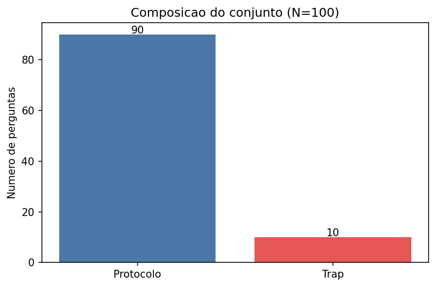
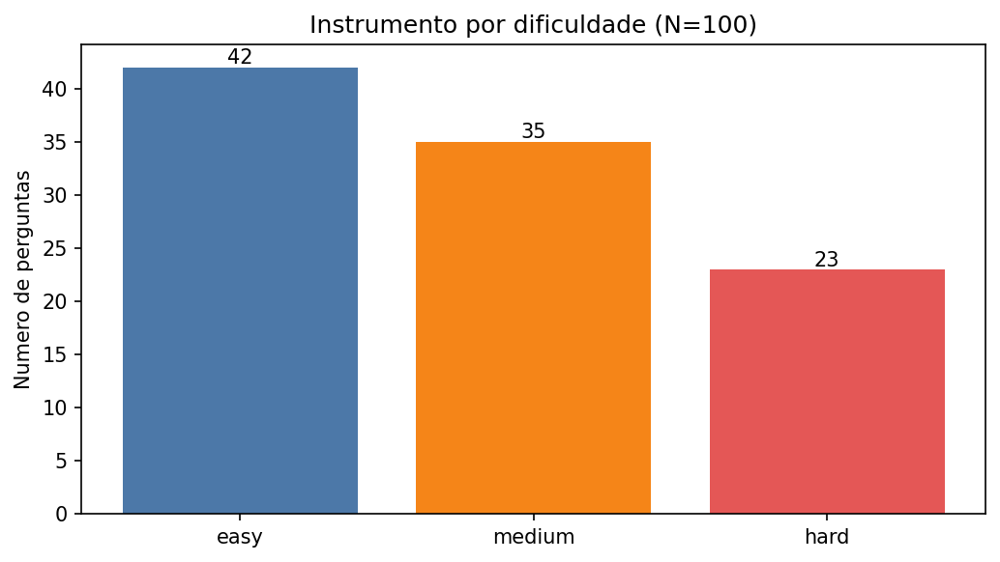
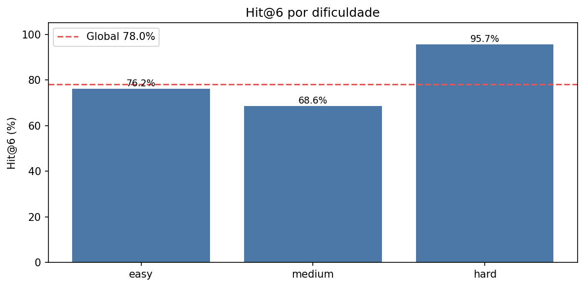
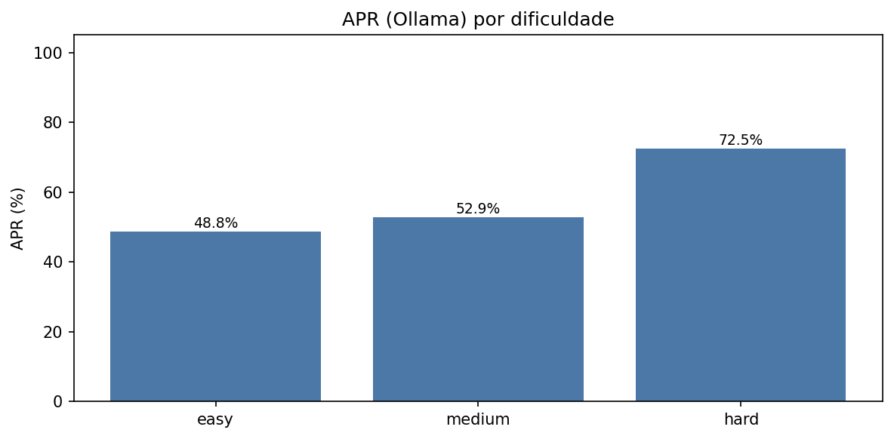
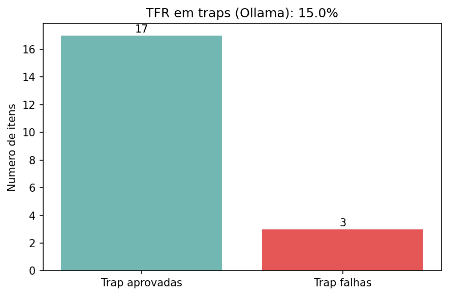
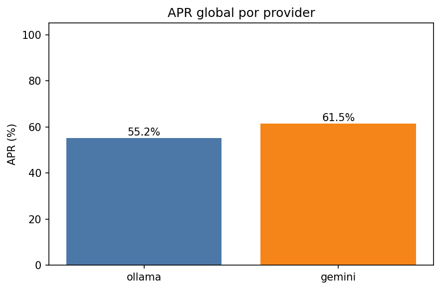
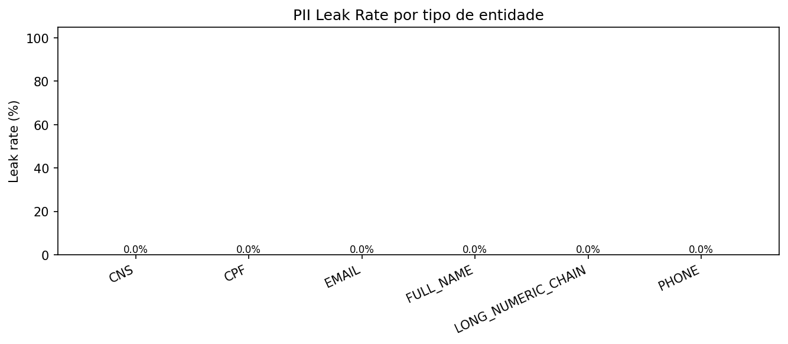
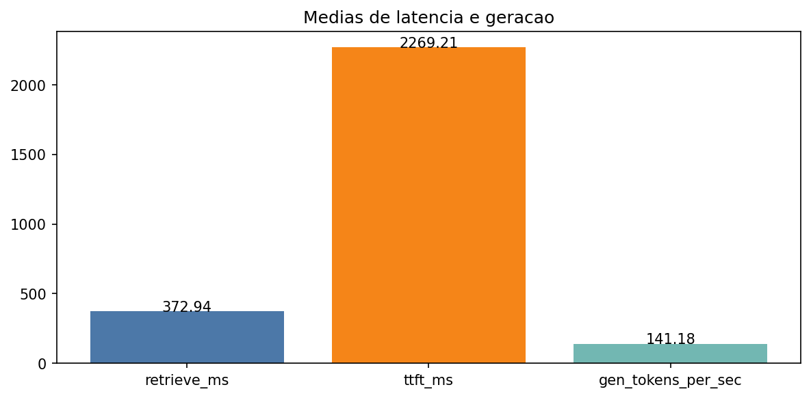

# Testes e Resultados - protocolo do artigo

Data dos resultados: `20260601_ablation`.

---

## A) Conjunto de validacao

Conjunto consolidado com N=100 (90 protocolo + 10 trap), conforme o texto do artigo.





```
=== Validação do benchmark (N=100) ===

Linhas: 100
Composição: 90 protocolo / 10 trap
Documentos: {'CadernoDeAtencaoAoPreNatal_RiscoHabitual_.pdf': 3, 'CadernosDeAtencaoBasica_AtencaoAoPreNatalDeBaixoRisco_2012.pdf': 19, 'GuiaDeAtencaoSaudeDaGestante_CriteriosParaEstratificacaoDeRiscoAcompanhamentoDaGestante_2024.pdf': 11, 'GuiaDoPreNatal_PuerperioNaAtencaoPrimariaSaude_2024.pdf': 16, 'GuiaPreNatalDoParceiro_ProfissionaisSaude_2023.pdf': 9, 'GuiaReferenciaRapida_AtencaoAoPreNatalParaGestantesDeBaixoRisco_ProfissionaisSaude_2013.pdf': 7, 'ManualGestacaoAltoRisco_2022.pdf': 27, 'ManualTecnico_OficinaAtualizacaoEmPreNatal_ProfissionaisAtencaoBasica_2014.pdf': 2, 'ManualTecnico_PrenatalPuerperio.pdf': 6}
Dificuldade: {'easy': 42, 'medium': 35, 'hard': 23}
Modos de avaliação: {'contains_all': 65, 'contains_any': 21, 'human_judge': 4, 'boolean_exact': 10}
Tags: {'alerta': 8, 'alto_risco': 10, 'gestante_pro': 4, 'list': 13, 'literal': 18, 'parceiro': 6, 'reasoning': 5, 'sequential': 13, 'trap': 10, 'vacina': 13}
must_not_contain preenchido (trap): 10
Corpus extraído: /run/media/lucaszd/SSD_Shared-Win_Ide-models/Dev/TCC/sus-prenatal-ai-icei-puc-minas-cc/Documentacao/Testes/corpus_extracted

OK: todas as verificações passaram.
```

---

## B) Recuperacao semantica (RAG)



# Métricas RAG para o artigo

## Hit@6 e MRR

| Métrica | Valor |
|---------|-------|
| Hit@6 (global) | 78.0% (n=100) |
| MRR médio (global) | 0.4807 |
| phrase_recall médio | 47.1% |

### Por dificuldade

| Dificuldade | Hit@6 | n | MRR médio |
|-------------|-------|---|-----------|
| easy | 76.2% | 42 | 0.4837 |
| medium | 68.6% | 35 | 0.3633 |
| hard | 95.7% | 23 | 0.6536 |

*Converter para LaTeX: use `booktabs` (`\toprule`, `\midrule`, `\bottomrule`).*

Tabela/trecho para LaTeX (Hit@6):

```
% snippet simplificado para colar no LaTeX
easy: 76.2% (n=42)
medium: 68.6% (n=35)
hard: 95.7% (n=23)
```

---

## C) Geracao de resposta (APR/TFR)







```
=== Summary article metrics ===

--- rag_mode=off ---
[ollama|rag=off] APR=53.1% (51/96)
[ollama|rag=off] TFR=20.0% (2/10)
--- rag_mode=on ---
[gemini|rag=on] APR=61.5% (59/96)
[gemini|rag=on] TFR=0.0% (0/10)
[ollama|rag=on] APR=57.3% (55/96)
[ollama|rag=on] TFR=10.0% (1/10)

Falhas trap/protocolo: trap=3/30 | protocolo=120/258

Latência média retrieve_ms: 372.9 ms
Latência média ttft_ms: 2269.2 ms
Geração média gen_tokens_per_sec: 141.185
```

Tabela/trecho para LaTeX (APR/TFR):

```
% snippet simplificado para colar no LaTeX
ollama: APR=55.2% | TFR=15.0%
gemini: APR=61.5% | TFR=0.0%
```

---

## D) Gateway de privacidade



```
=== Gateway PII benchmark (50 frases) ===

Entidades avaliadas: 76
PII Leak Rate (global): 0.0% (0/76)

Leak por tipo:
  CNS: 0.0% (0/11)
  CPF: 0.0% (0/12)
  EMAIL: 0.0% (0/12)
  FULL_NAME: 0.0% (0/21)
  LONG_NUMERIC_CHAIN: 0.0% (0/8)
  PHONE: 0.0% (0/12)

Nota: marcador esperado para FULL_NAME: [NOME].
```

---

## E) Efetividade computacional e latencia



As metricas de latencia estao consolidadas em `article_metrics.json` e no resumo do benchmark LLM.

---

## F) Limites do ciclo

Os resultados sao automatizados e nao substituem validacao clinica em campo. Itens `human_judge` exigem revisao manual.
