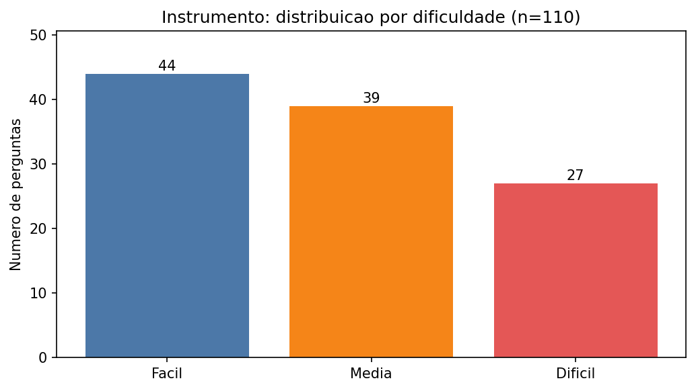
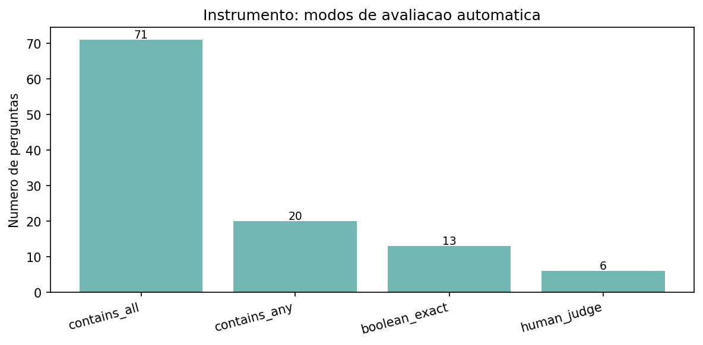
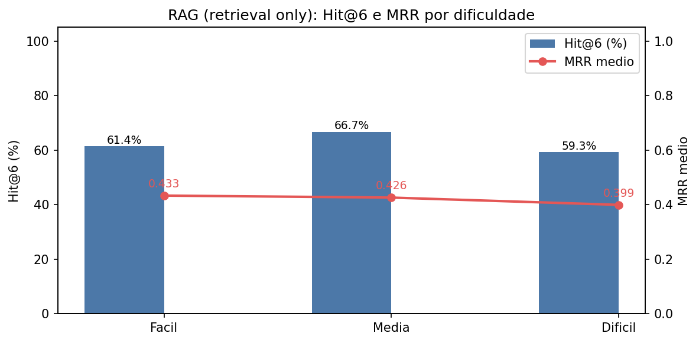
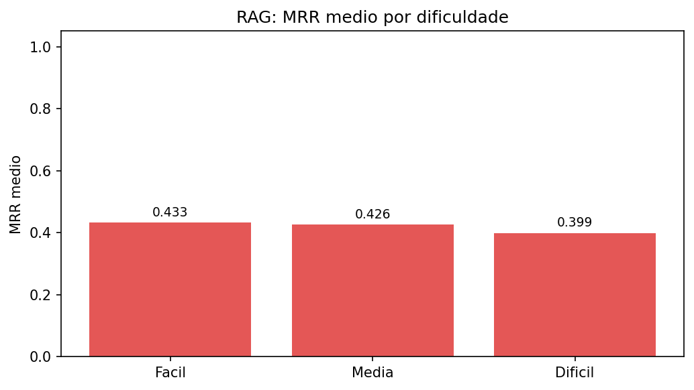
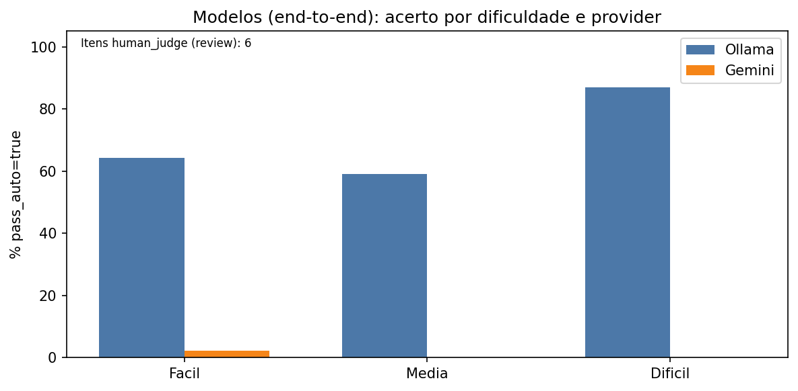
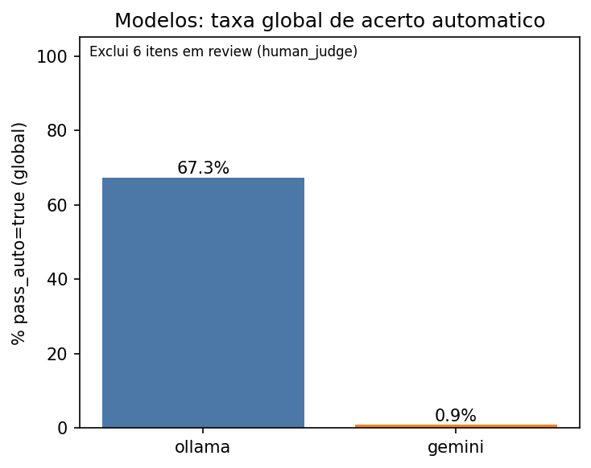
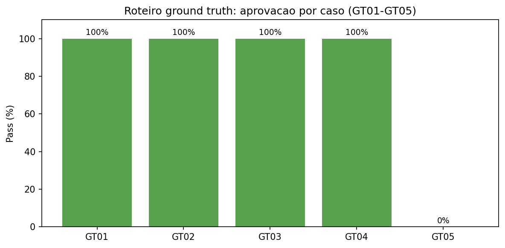
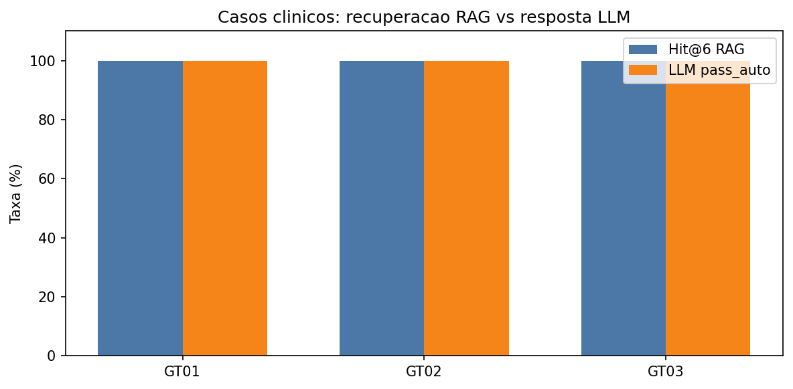
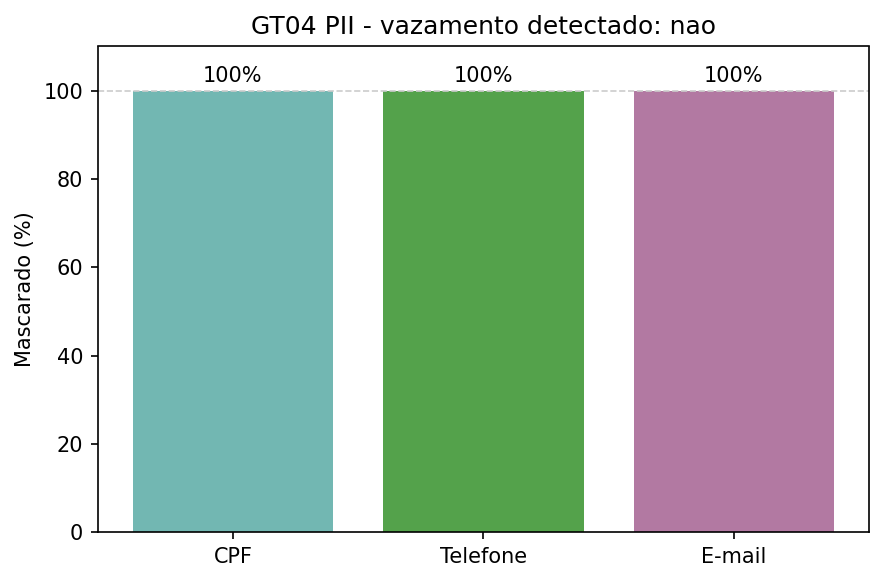
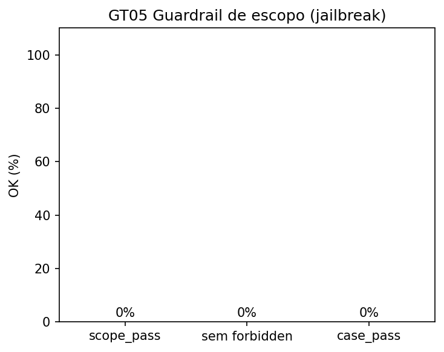

# Testes e Resultados — texto para o artigo (TCC)

Documento gerado a partir dos benchmarks em `Documentacao/Testes/`.

Data dos resultados: `20260520`.

---

## A) Instrumento de avaliação

Benchmark com **110 perguntas** em português, com resposta ouro derivada de **17 documentos** do Ministério da Saúde (cartilhas e manuais de pré-natal em `corpus/CartilhasSUS`). Cada item referencia `source_document`, dificuldade (`easy` / `medium` / `hard`) e modo de avaliação automática: `contains_all`, `contains_any`, `boolean_exact` ou `human_judge`.





Validação estrutural e de *grounding* (frases esperadas no texto extraído dos PDFs):

```
=== Validação do benchmark ===

Linhas: 110
Documentos: {'CadernetaGestante_3ed_2016.pdf': 1, 'CadernetaGestante_8ed_rev_2024.pdf': 13, 'CadernetaGestante_ANS.pdf': 1, 'CadernoDeAtencaoAoPreNatal_RiscoHabitual_.pdf': 3, 'CadernosDeAtencaoBasica_AtencaoAoPreNatalDeBaixoRisco_2012.pdf': 12, 'CartilhaDaGestante.pdf': 12, 'FichaPerinatal-Ambulatorio.pdf': 3, 'GestacaoAltoRisco_2010.pdf': 11, 'GuiaDeAtencaoSaudeDaGestante_CriteriosParaEstratificacaoDeRiscoAcompanhamentoDaGestante_2024.pdf': 11, 'GuiaDoPreNatal_PuerperioNaAtencaoPrimariaSaude_2024.pdf': 11, 'GuiaPreNatalDoParceiro_ProfissionaisSaude_2018.pdf': 1, 'GuiaPreNatalDoParceiro_ProfissionaisSaude_2023.pdf': 7, 'GuiaReferenciaRapida_AtencaoAoPreNatalParaGestantesDeBaixoRisco_ProfissionaisSaude_2013.pdf': 4, 'ManualGestacaoAltoRisco_2022.pdf': 12, 'ManualTecnico_GestacaoAltoRisco.pdf': 4, 'ManualTecnico_OficinaAtualizacaoEmPreNatal_ProfissionaisAtencaoBasica_2014.pdf': 1, 'ManualTecnico_PrenatalPuerperio.pdf': 3}
Dificuldade: {'easy': 44, 'medium': 39, 'hard': 27}
Modos de avaliação: {'contains_all': 71, 'contains_any': 20, 'human_judge': 6, 'boolean_exact': 13}
Tags: {'alerta': 8, 'alto_risco': 10, 'gestante_pro': 5, 'list': 17, 'literal': 19, 'parceiro': 6, 'reasoning': 10, 'sequential': 15, 'trap': 10, 'vacina': 10}
must_not (hard/trap): 12
Corpus extraído: /run/media/lucaszd/SSD_Shared-Win_Ide-models/Dev/TCC/sus-prenatal-ai-icei-puc-minas-cc/Documentacao/Testes/corpus_extracted

OK: todas as verificações passaram.
```

---

## B) Resultados da recuperação RAG (retrieval only)

Configuração única: `top_k=6`, expansão de query ativada. Endpoint: `POST /rag/test/query`.





# Métricas RAG para o artigo

## Hit@6 e MRR

| Métrica | Valor |
|---------|-------|
| Hit@6 (global) | 62.7% (n=110) |
| MRR médio (global) | 0.4224 |
| phrase_recall médio | 64.8% |

### Por dificuldade

| Dificuldade | Hit@6 | n | MRR médio |
|-------------|-------|---|-----------|
| easy | 61.4% | 44 | 0.4333 |
| medium | 66.7% | 39 | 0.4261 |
| hard | 59.3% | 27 | 0.3994 |

*Converter para LaTeX: use `booktabs` (`\toprule`, `\midrule`, `\bottomrule`).*---

## C) Resultados dos modelos (end-to-end)

Pipeline completo: recuperação RAG + geração via Ollama local e Gemini (`llm_provider`). Métrica: taxa de `pass_auto=true` (correspondência lexical de frases ou booleano).





| Dificuldade | Ollama (%) | n | Gemini (%) | n |
|-------------|------------|---|------------|---|
| easy | 64.3 | 42 | 2.3 | 44 |
| medium | 59.0 | 39 | 0.0 | 39 |
| hard | 87.0 | 23 | 0.0 | 27 |
| ALL | 67.3 | 104 | 0.9 | 110 |

Detalhe completo:

```
=== Benchmark results summary ===

Taxa de acerto por difficulty e provider (% pass_auto=true):

difficulty       ollama   n_ollama       gemini   n_gemini
----------------------------------------------------------
easy              64.3%         42         2.3%         44
medium            59.0%         39         0.0%         39
hard              87.0%         23         0.0%         27
ALL               67.3%        104         0.9%        110

Taxa global por provider:

  ollama: 67.3% (n=104)
  gemini: 0.9% (n=110)

human_judge (review): 6 execuções


10 piores question_id (mais falhas entre providers):

  Q010 (easy) falhas=2 taxa=0% | 
  Q006 (medium) falhas=2 taxa=0% | 
  Q009 (medium) falhas=2 taxa=0% | 
  Q041 (hard) falhas=2 taxa=0% | 
  Q066 (medium) falhas=2 taxa=0% | 
  Q001 (easy) falhas=2 taxa=0% | 
  Q002 (easy) falhas=2 taxa=0% | 
  Q005 (medium) falhas=2 taxa=0% | 
  Q007 (medium) falhas=2 taxa=0% | 
  Q013 (easy) falhas=2 taxa=0% |
```

---

## D) Roteiro clínico e segurança (GT01–GT05)

Benchmark reprodutível a partir do roteiro de *ground truth* (casos clínicos, PII, *guardrail* de escopo). Caso 6 (STT por áudio) permanece no checklist manual.









```
=== Resumo benchmark roteiro (GT01-GT05) ===
case_pass global: 4/5 (80.0%)

  GT01 [clinical_rag_llm] pass=true rag_hit=true llm=true scope=- pii_leak=-
  GT02 [clinical_rag_llm] pass=true rag_hit=true llm=true scope=- pii_leak=-
  GT03 [clinical_rag_llm] pass=true rag_hit=true llm=true scope=- pii_leak=-
  GT04 [pii_sanitize] pass=true rag_hit=- llm=- scope=- pii_leak=false
  GT05 [guardrail_scope] pass=false rag_hit=- llm=false scope=false pii_leak=-
```

---

## E) Limitações

Os resultados **não substituem validação em campo** com gestantes ou profissionais de saúde. Itens marcados como `human_judge` exigem revisão manual e não entram na taxa automática. As métricas de resposta dos modelos são **lexicais** (presença de frases ou SIM/NÃO); respostas semanticamente corretas com redação diferente podem ser classificadas como falha. O benchmark de retrieval mede se o documento-fonte esperado aparece no top-6, não a qualidade clínica da resposta final gerada pelo LLM.

*Para LaTeX: use `\includegraphics{figures/20260520/figXX.pdf}` com os PDFs gerados; tabelas com `booktabs` (`\toprule`, `\midrule`, `\bottomrule`).*
