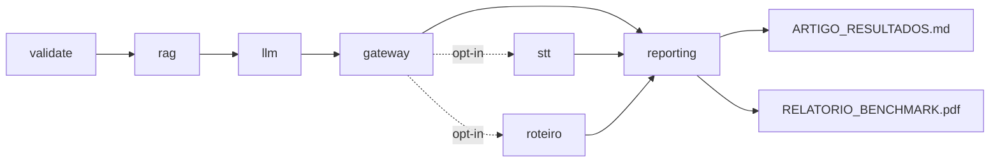

# Suite de avaliacao do artigo/TCC

Pipeline reprodutivel para o protocolo do artigo: N=100, Hit@6, APR/TFR, PII leak, WER/STT, latencia e relatorio.

**Pre-requisitos:** Python 3.11+, Docker (`clinical_ai` em `:4010`).

## Quick start

```bash
cd Documentacao/Testes && ./scripts/setup.sh
./scripts/run_smoke.sh
export BASE_URL=http://127.0.0.1:4010
./scripts/run_pipeline.sh
```

## Pipeline

| Step | Bloco | Metrica | Servico |
|------|-------|---------|---------|
| 1 | `01_validate_dataset` | schema + grounding | offline |
| 2 | `02_rag_retrieval` | Hit@6 | clinical_ai |
| 3 | `03_llm_end_to_end` | APR/TFR + latencia | clinical_ai (+ Gemini) |
| 4 | `04_gateway_pii` | PII leak rate | clinical_ai |
| 5 | `05_stt` (opt-in) | WER, phrase recall | stt :8000 + GPU |
| 6 | `06_roteiro_gt` (opt-in) | GT01-GT05 | clinical_ai |
| 7 | `reporting` | figuras + `ARTIGO_RESULTADOS_*.md` | offline |
| 8 | `reporting` | `RELATORIO_BENCHMARK_*.pdf` (LaTeX) | offline + latexmk |

Saidas: `artifacts/runs/<BENCH_DATE>/`, `artifacts/figures/`, `artifacts/reports/`.

Detalhes: [docs/PIPELINE.md](docs/PIPELINE.md) | Metricas: [docs/METRICS.md](docs/METRICS.md)


