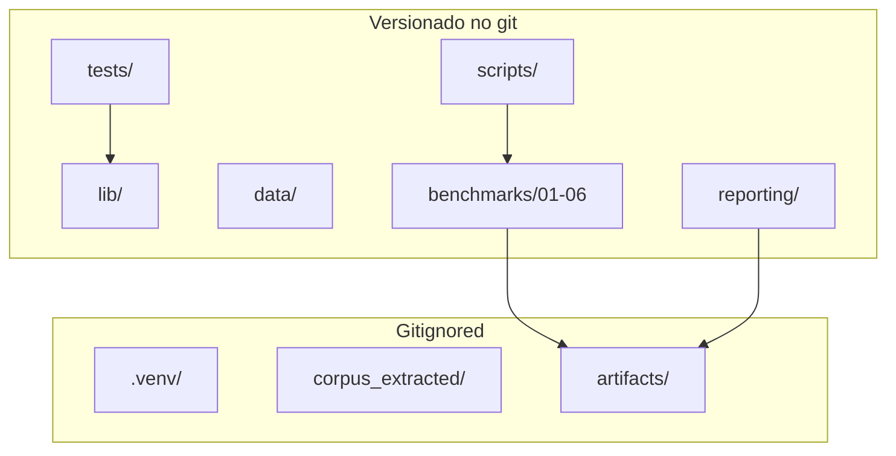

# Arquitetura da suite de testes

Separacao clara entre codigo, dados fonte e artefatos de execucao.

## Modulos `lib/`

| Arquivo | Responsabilidade |
|---------|------------------|
| `paths.py` | Contrato de paths (ROOT, DATA, ARTIFACTS) |
| `bench_scoring.py` | Scoring APR/TFR automatico |
| `rag_metrics.py` | Hit@6, MRR, phrase recall em chunks |
| `stt_scoring.py` | WER, phrase recall, jargao STT |
| `obstetric_jargon.py` | Normalizacao de jargao obstetrico |
| `article_metrics.py` | Agregacoes para figuras e JSON |

## Fluxo de dados

1. `data/prenatal_sus_benchmark.csv` — fonte N=100
2. Benchmarks escrevem CSVs/JSONL em `artifacts/runs/<stamp>/`
3. `reporting/` le artefatos e gera figuras, dashboard e relatorio Markdown

## Compatibilidade

- `clinical_ai` :4010 — RAG, LLM, gateway, roteiro
- `stt-service` :8000 — bloco 05 (opt-in, GPU)
- `run_all_benchmarks.sh` na raiz e shim que delega para `scripts/run_pipeline.sh`
